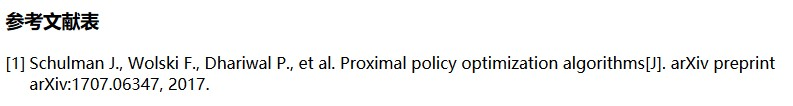
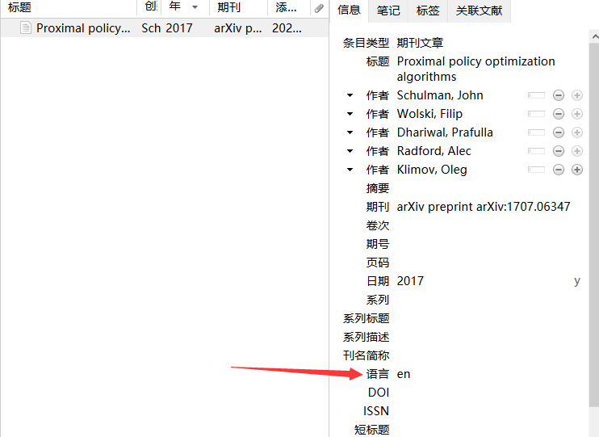

# 中国大部分大学研究生毕业论文引用格式
# GB/T 7714-2015 CSL 文件修改说明

参考资料：[https://zhuanlan.zhihu.com/p/581479488](https://zhuanlan.zhihu.com/p/581479488)

本 CSL 文件对以下内容进行了修改：

1. **去除 DOI**：根据 GB/T 7714-2005 和 GB/T 7714-2015 的要求，去除了文献中的 DOI 信息。
2. **去除 OL**：去除了文献中的 OL 信息。
3. **去除引用文献/添加文献的日期**：去除了引用文献和添加文献的日期信息。
4. **英文作者大小写修改**：对英文作者的名字进行了大小写修改，使其符合规范。参考资料里的改法，英文姓氏后面没有省略号，本文已修改 
>   e.g. 错误：Alibaba F → 正确：Alibaba F.
5. **双语切换**：在 Zotero 中修改英文文献的“等”为“et al”。

修改效果请如图所示 

如果你的英文还不对的话，请去zotero里改属性
 
